# Application Architecture - Mermaid Diagrams

This document contains Mermaid diagrams visualizing the architecture and flow of the parallel image processing system.

## System Overview

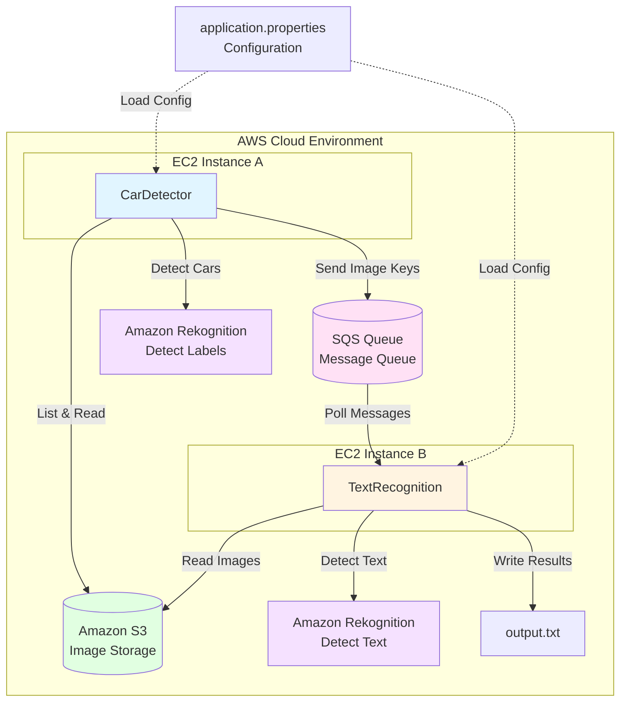

## CarDetector Flow

```mermaid
car
```

## TextRecognition Flow

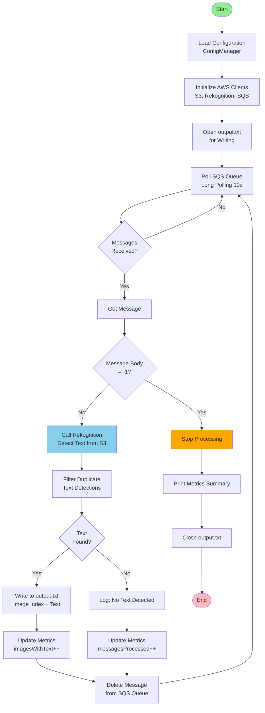

## Sequence Diagram - Complete Flow

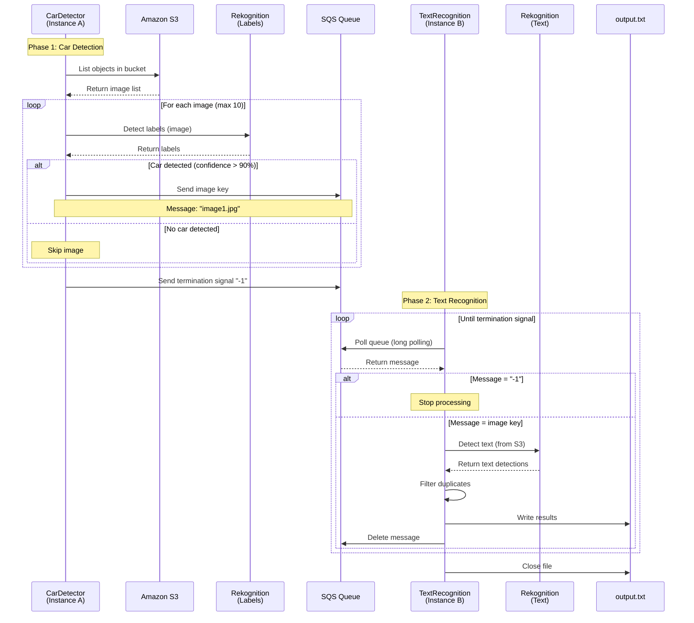

## Component Interaction Diagram

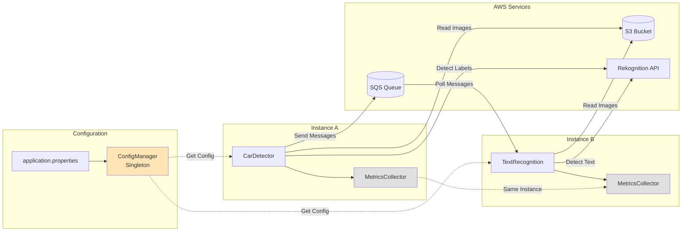

## Data Flow Diagram

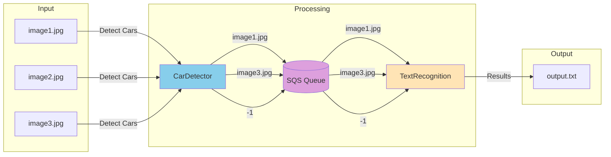

## State Diagram - Message Lifecycle

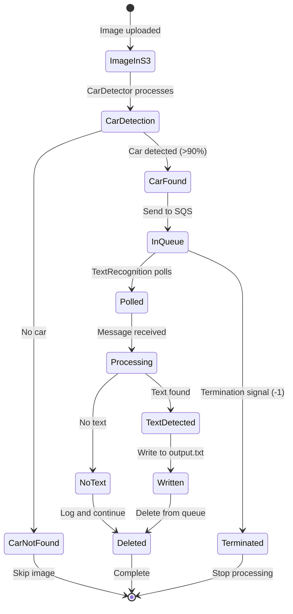

## Class Diagram

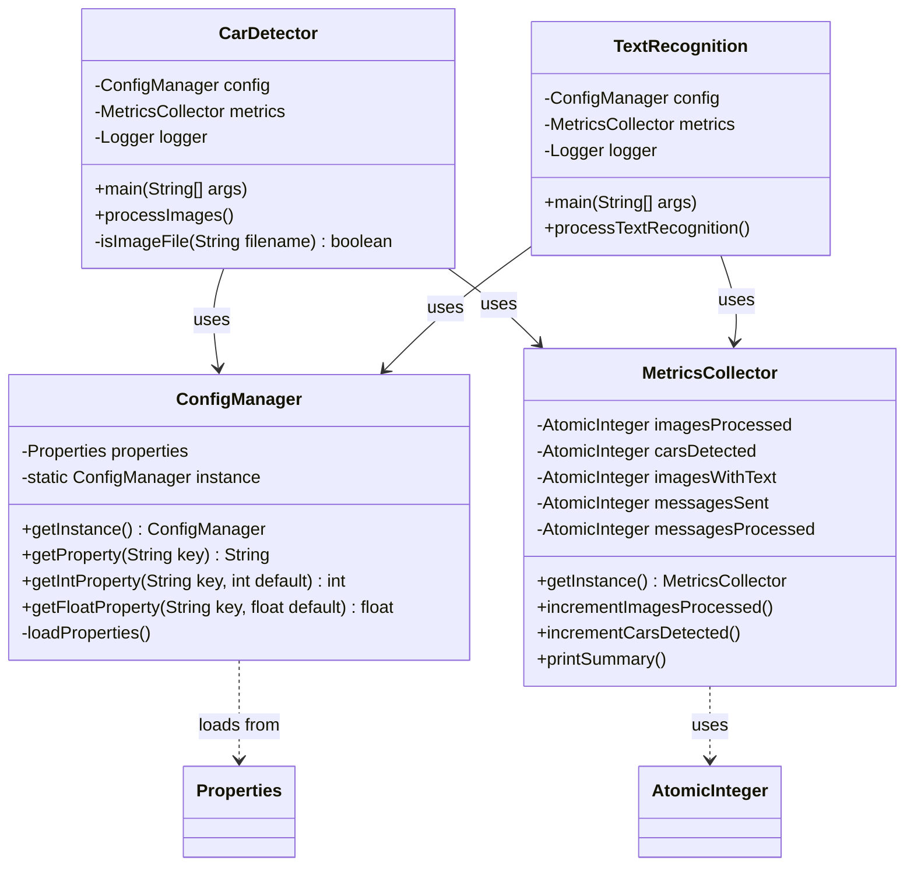

## Deployment Architecture

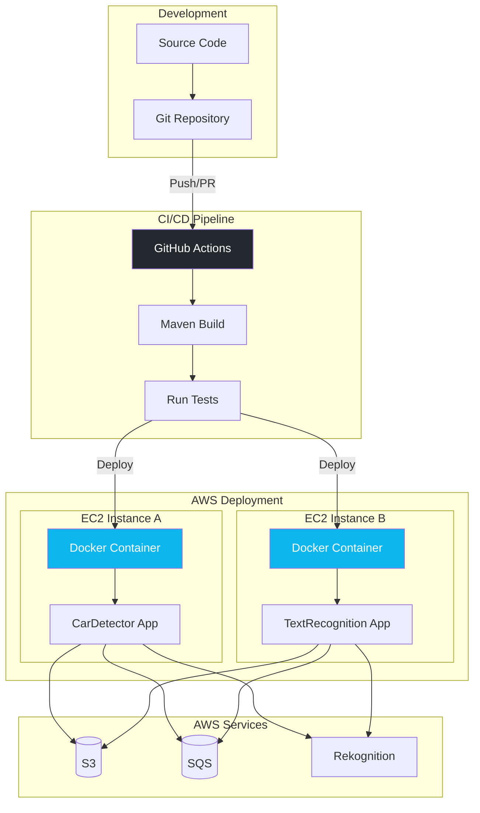

## Metrics Flow

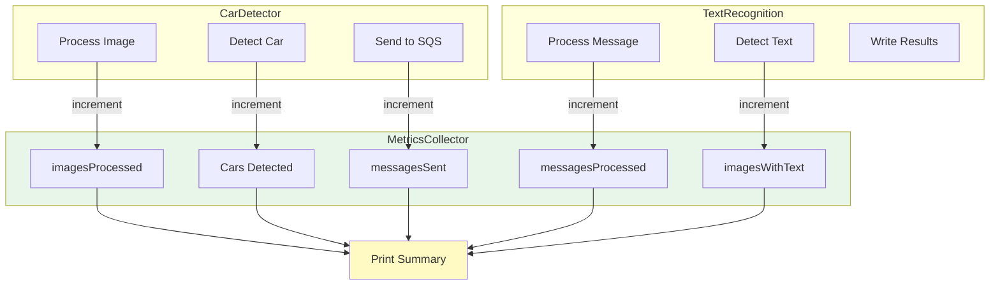

## Error Handling Flow

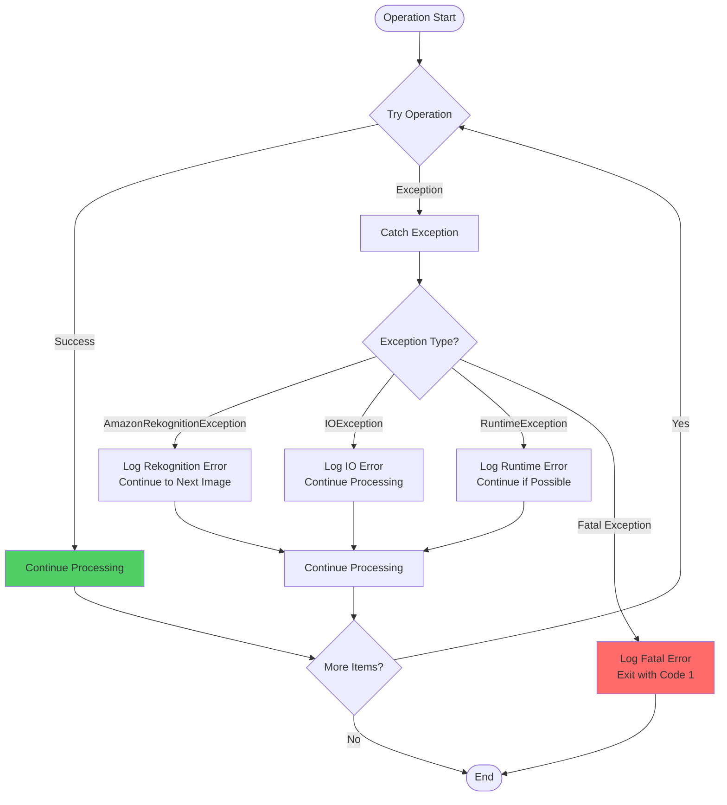

## Configuration Management Flow

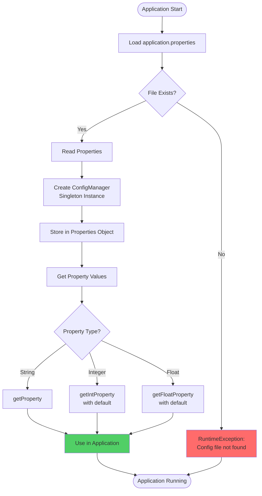

---

## How to View These Diagrams

These Mermaid diagrams can be viewed by copying the code to https://mermaid.live/